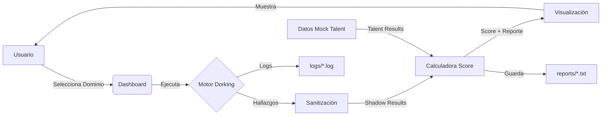

# Especificación para Dashboard OSINT SaaS - Artefacto de Ensayo

## 🎯 Objetivo
Construir un **Dashboard Interactivo de Ensayo** que sirva como interfaz visual para el proyecto OSINT SaaS, permitiendo simular la ejecución del motor de dorking, visualizar hallazgos en tiempo real y generar reportes de riesgo consolidados.

---

## 🏗️ Arquitectura del Proyecto Actual

### Estructura de Directorios
```
/workspace/
├── motor_dorking.py          # Motor de búsqueda de activos shadow
├── reportescore.py           # Calculadora de scores y generador de reportes
├── test_produccion_simulada.py  # Suite de pruebas con datos reales
├── requirements.txt          # Dependencias (python-dotenv)
├── .env                      # Variables de entorno (CLIENT_NAME, TARGET_DOMAIN)
├── deploy.sh                 # Script de despliegue
├── PRODUCCION.md             # Documentación técnica
├── logs/                     # Logs del sistema
├── reports/                  # Reportes generados (.txt)
└── data/                     # Datos temporales
```

### Módulos Principales

#### 1. `motor_dorking.py`
- **Función**: Ejecuta búsquedas Dorking para encontrar activos expuestos
- **Entradas**: Dominio objetivo (`TARGET_DOMAIN`)
- **Salidas**: Diccionario con hallazgos estructurados:
  ```python
  {
    "aws_keys": [...],
    "db_exposed": [...],
    "sensitive_urls": [...],
    "sensitive_files": [...],
    "subdomains": [...]
  }
  ```
- **Características**: Validación de dominio, sanitización de findings, logging, CLI support

#### 2. `reportescore.py`
- **Función**: Calcula scores de riesgo y genera reportes consolidados
- **Entradas**: 
  - `talent_results`: Datos de inteligencia de talento (breaches, emails, keys)
  - `shadow_results`: Hallazgos del motor de dorking
- **Salidas**: 
  - Score consolidado (0-100)
  - Nivel de riesgo (BAJO/MEDIO/ALTO/CRÍTICO)
  - Reporte detallado en `reports/`
- **Características**: Validación de datos, manejo de casos borde, logging

---

## 📊 Requisitos del Dashboard

### 1. Interfaz Principal
- **Header**: Nombre del cliente (`CLIENT_NAME`) y dominio objetivo
- **Panel de Control**:
  - Botón "Ejecutar Motor Dorking" (simulado o real)
  - Selector de dominio objetivo
  - Indicador de estado (En espera / Ejecutando / Completado / Error)

### 2. Visualización de Hallazgos (Shadow Assets)
- **Tarjetas Métricas** (5 tarjetas):
  - 🔑 AWS Keys Expuestas
  - 💾 Bases de Datos Expuestas
  - 🔗 URLs Sensibles
  - 📄 Archivos Sensibles
  - 🌐 Subdominios Encontrados
- **Tablas Detalladas**: Cada categoría con lista expandible de hallazgos
- **Mapa de Calor**: Distribución de riesgos por categoría

### 3. Visualización de Talent Intelligence
- **Perfil de Ejecutivos/Desarrolladores**:
  - Número de breaches encontrados
  - Emails comprometidos
  - API keys filtradas
  - Credenciales expuestas
- **Gráfico de Barras**: Riesgo por empleado

### 4. Score de Riesgo Consolidado
- **Gauge Chart**: Score 0-100 con zonas de color:
  - 🟢 0-25: BAJO
  - 🟡 26-50: MEDIO
  - 🟠 51-75: ALTO
  - 🔴 76-100: CRÍTICO
- **Desglose**:
  - Talent Intelligence Score (peso 40%)
  - Shadow Assets Score (peso 60%)
- **Recomendaciones Automáticas**: Basadas en el nivel de riesgo

### 5. Generación de Reportes
- **Botón "Generar Reporte"**: Crea archivo `.txt` en `reports/`
- **Vista Previa**: Mostrar contenido del reporte en modal
- **Historial**: Lista de reportes generados con fecha y score

### 6. Logs en Tiempo Real
- **Consola Integrada**: Streaming de logs del sistema
- **Filtros**: INFO, WARNING, ERROR, CRITICAL
- **Exportar Logs**: Botón para descargar `.log`

---

## 🧪 Modo Ensayo/Simulación

El dashboard debe incluir un **Modo Simulación** que:

1. **Datos Mock Realistas**:
   - Usar los datos de `test_produccion_simulada.py` como base
   - Generar variaciones aleatorias para múltiples ejecuciones
   - Incluir casos borde (datos vacíos, None, estructuras incompletas)

2. **Simulación de Ejecución**:
   - Progress bar con pasos simulados:
     - "Iniciando motor..." (2s)
     - "Buscando AWS keys..." (3s)
     - "Escaneando subdominios..." (4s)
     - "Validando hallazgos..." (2s)
     - "Completado" (total ~11s)
   - Animaciones de carga entre pasos

3. **Escenarios Predefinidos**:
   - 🟢 Escenario Bajo Riesgo: Score 15-25
   - 🟡 Escenario Medio Riesgo: Score 40-55
   - 🟠 Escenario Alto Riesgo: Score 65-75
   - 🔴 Escenario Crítico: Score 80-95 (default de prueba)

---

## 🛠️ Stack Tecnológico Sugerido

### Opción A: Streamlit (Recomendado para prototipo rápido)
```python
# dependencies: streamlit, plotly, pandas
- Interfaz declarativa en Python
- Gráficos interactivos con Plotly
- Fácil integración con módulos existentes
- Deploy en Streamlit Cloud gratuito
```

### Opción B: React + FastAPI
```javascript
// Frontend: React + TailwindCSS + Recharts
// Backend: FastAPI (Python) que llama a motor_dorking.py y reportescore.py
- Mayor personalización
- SPA moderna
- Requiere más desarrollo
```

### Opción C: Flask + HTML/JS
```python
# dependencies: flask, chart.js
- Ligero y simple
- Templates Jinja2
- Bueno para MVP
```

**Recomendación**: Usar **Streamlit** para este artefacto de ensayo por:
- ✅ Integración directa con código Python existente
- ✅ Desarrollo rápido (< 200 líneas)
- ✅ Gráficos profesionales incluidos
- ✅ Fácil de compartir y desplegar

---

## 📐 Diseño de Componentes (Wireframe)

```
┌─────────────────────────────────────────────────────────────┐
│  🕵️ OSINT SaaS Dashboard              [Cliente: ACME Corp] │
│  Dominio: ejemplo.com                   [🔄 Ejecutar]      │
├─────────────────────────────────────────────────────────────┤
│  ESTADO: ✅ Completado (última ejc: 2026-06-30 22:01)      │
├─────────────────────────────────────────────────────────────┤
│  ┌──────┐ ┌──────┐ ┌──────┐ ┌──────┐ ┌──────┐             │
│  │ AWS  │ │  DB  │ │ URLs │ │ Arch │ │ Sub  │             │
│  │  2   │ │  2   │ │  4   │ │  4   │ │  5   │             │
│  │ 🔴   │ │ 🔴   │ │ 🟠   │ │ 🟠   │ │ 🟡   │             │
│  └──────┘ └──────┘ └──────┘ └──────┘ └──────┘             │
├─────────────────────────────────────────────────────────────┤
│  ┌─────────────────────┐  ┌─────────────────────────────┐  │
│  │   SCORE CONSOLIDADO │  │   TALENT INTELLIGENCE       │  │
│  │                     │  │                             │  │
│  │      ╭─────╮        │  │  👤 CEO: 3 breaches         │  │
│  │     ╱  80   ╲       │  │  👤 CTO: 1 breach           │  │
│  │    │  CRÍTICO │     │  │  👤 Dev1: 2 keys filtradas  │  │
│  │     ╲       ╱       │  │                             │  │
│  │      ╰─────╯        │  │  [Ver detalles]             │  │
│  └─────────────────────┘  └─────────────────────────────┘  │
├─────────────────────────────────────────────────────────────┤
│  📋 HALLAZGOS DETALLADOS                                    │
│  ┌───────────────────────────────────────────────────────┐  │
│  │ Categoría ▼  |  Riesgo  |  Detalles                   │  │
│  │ AWS Keys     |  CRÍTICO |  AKIA1234..., AKIA5678...   │  │
│  │ DB Expuestas |  CRÍTICO |  192.168.1.1:3306, ...      │  │
│  │ ...          |    ...   |  ...                        │  │
│  └───────────────────────────────────────────────────────┘  │
├─────────────────────────────────────────────────────────────┤
│  📊 LOGS EN TIEMPO REAL                                     │
│  [INFO] Motor iniciado                                      │
│  [INFO] Buscando en Google...                               │
│  [WARNING] 2 AWS keys encontradas                           │
│  [INFO] Sanitización completada                             │
│  [SUCCESS] Score calculado: 80/100                          │
│                                           [Exportar Logs]   │
└─────────────────────────────────────────────────────────────┘
```

---

## 🔄 Flujo de Datos



---

## 📁 Archivos a Generar por la IA

La IA debe crear:

1. **`dashboard.py`** (Streamlit) o equivalente:
   - Importa `motor_dorking` y `reportescore` (o simula sus funciones)
   - Implementa todos los componentes visuales descritos
   - Incluye modo simulación con datos mock

2. **`requirements_dashboard.txt`**:
   ```
   streamlit>=1.30.0
   plotly>=5.18.0
   pandas>=2.0.0
   python-dotenv>=1.0.0
   ```

3. **`README_DASHBOARD.md`**:
   - Instrucciones de instalación
   - Cómo ejecutar: `streamlit run dashboard.py`
   - Explicación del modo simulación

4. **`data/mock_data.json`** (opcional):
   - Datos predefinidos para escenarios de prueba

---

## ✅ Criterios de Aceptación

El artefacto se considera completo cuando:

- [ ] El dashboard se ejecuta sin errores con `streamlit run dashboard.py`
- [ ] Muestra al menos 4 categorías de hallazgos con datos mock
- [ ] El gauge de score funciona y cambia según el escenario seleccionado
- [ ] El botón "Ejecutar" muestra animación de progreso simulada
- [ ] Se genera un reporte `.txt` en la carpeta `reports/` al hacer clic
- [ ] Los logs se muestran en tiempo real durante la simulación
- [ ] El diseño es responsive (funciona en móvil y desktop)
- [ ] Incluye al menos 3 escenarios predefinidos (Bajo, Medio, Crítico)

---

## 🚀 Instrucciones para la IA Constructora

> "Usa esta especificación para construir un dashboard funcional en Streamlit que integre los módulos `motor_dorking.py` y `reportescore.py` existentes. Prioriza la experiencia de usuario con animaciones suaves, gráficos interactivos y modo simulación robusto. El código debe ser limpio, comentado y listo para producción."

---

**Versión del Documento**: 1.0  
**Fecha**: 2026-06-30  
**Proyecto**: OSINT SaaS Dashboard de Ensayo
